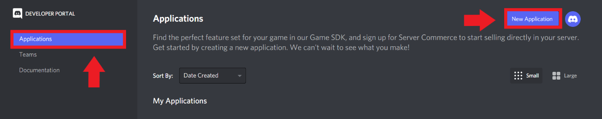
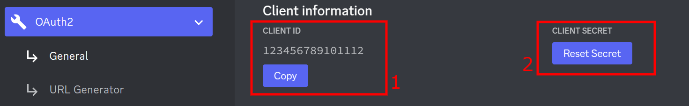

# Discord Bot

This is a simple Discord Bot I made for my own server. It is in developing (My first Bot and I'm still learning bout it :D). You are free to use this for your server. Cheer !!


## Documentation

This Bot is built in Javascript using discord.js v14. For futher details, you can check these documentations.

[discord.js](https://discord.js.org/#/docs/discord.js/main/general/welcome)

[DiscordJS guide](https://discordjs.guide)

[Discord Developer Documentation](https://discord.com/developers/docs/intro)
## Features

- Emojis free-to-use (You can use any emojis you like as long as the server has added this Bot.)
- Sharding
- Server Stats (Count members, bots, and the status of members)
- Global & Private server slash commands (You can set specific commands just for your own server)


## Installation

Install my-project with npm

```bash
cd my-project
npm install my-project  
```

Go to this page [Developer Portal](https://discord.com/developers/applications) and logged in.

Create your own Bot.



You can search more or check this [link](https://www.ionos.com/digitalguide/server/know-how/creating-discord-bot/) for creating and add Bot to your server.

Then copy and save your Bot Id and Token


## Environment Variables

To run this project, you will need to add the following environment variables to your .env file (if dont have it, create new one)

`TOKEN` - Bot Token

`CLIENT_ID` - Bot Id

`GUILD_ID` - your guild id for private commands


## Notes

This is a new Bot, thus it does not have a Database yet. Make it by yourself.